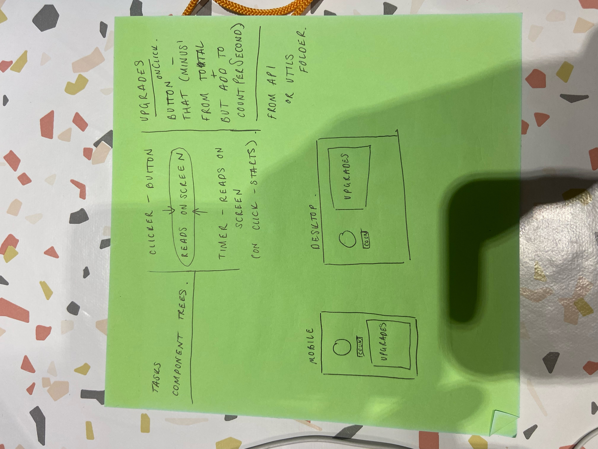

Reflection

Please also provide an assignment reflection in your project README.md file.

Required

🎯 What requirements did you achieve?

🎯 Were there any requirements or goals that you were unable to achieve?

🎯 If so, what was it that you found difficult about these tasks?

Optional

🏹 Feel free to add any other reflections you would like to share about your submission, for example:

Requesting feedback about a specific part of your submission.

What useful external sources helped you complete the assignment (e.g YouTube tutorials)?

What errors or bugs did you encounter while completing your assignment? How did you solve them?

What went really well and what could have gone better?

At a glance I think I was able to implement all but the last requirement as my upgrade buttons do not work.

With more time and planning I would of been able to attempt the upgrades button. I understand the logic of making these upgrades work, but implementing them into different buttons would of taken a lot longer than the time I had remaining.

I finished Friday afternoon deep inside a learning pit, I applied what I knew and asked the cohort for help. This was after having tried every which way possible as well as some Google searches in desparation.

Ashir luckily came to my rescue. And I learnt a lot along the way. My finished app looks basic, I get that, but without Ashir's help it would have looked even more basic, if you could believe that...
I was able to have a timer going and a log of my clicks both serperate to one another, as well as the upgrades being shown from a data.json file within my app. I knew I had to parse props to each component in order for them to work and display together in one counter, but I had exhausted my knowledge and my attempts had left me back at square one.

Ashir helped me understand where I needed to define my useState properties in order to parse them properly, and it was with this I was able to understand how I could succesfully use them within another component and then use them properly in a function in order to combine both my 'cookie clicks' and 'cookies per second'.

Not only that but he helped me with some what may seem like quite simple CSS but it really helped me make my data.json information look a lot more presentable.

I am hesitant to look for help within projects as I don't want it to hinder my learning, I don't want help if it's already above me because I'm not going to learn from it, I'd rather stop where I'm comfortable and ask my senior devs for guidance. I am SO glad I asked Ashir for help, he walked me through it, I knew why I was doing it and he gave me a bit more confidence in my coding journey. Big up Ashir!

Time wasn't on my side this week, I am well aware I didn't include any media queries, which each week I feel guilty about.
I intend to do some external CSS learning as I think that is holding me back a bit, apologises for the lack of media queries. I had intended to do a mobile and desktop version but I had to take what I could get!

In regards to requesting feedback about a specific part of my submission, perhaps a little bit of guidance as what would be the best way to go around the logic of implementing the upgrade buttons.
Oh and are there any sort-of places you know of I could look for in regards to well designed website or apps, that I could gain inspiration for my own assingments.

Thank you.
